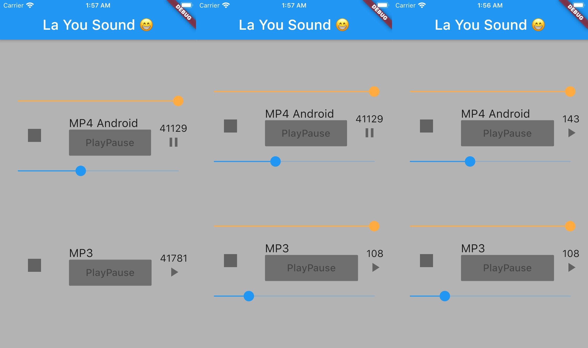

# Audio

Ce projet contient montre comment faire des player async.

- Play/pause press
- progress bar slider
- volume bar slider

# Architecture

Impossible pour moi de gerer le player dans un simple state comme l'appli dashcast, mais je savais pas comment appréhender des players asynchrone, je suis tomber sur ça [https://pub.dev/packages/states_rebuilder](https://pub.dev/packages/states_rebuilder) qui avait l'air super pour ça mais j'ai pas reussi et pire encore  il y avait quelle chose de pas clair, et au final je me suis dis les arbres c'est cool go provider / model et très vite j'ai compris qu'une architecture en bloc sera bcp plus adapter

# SubApp

1. Player 
    - touchable play/pause and stop
    - widget volume / position